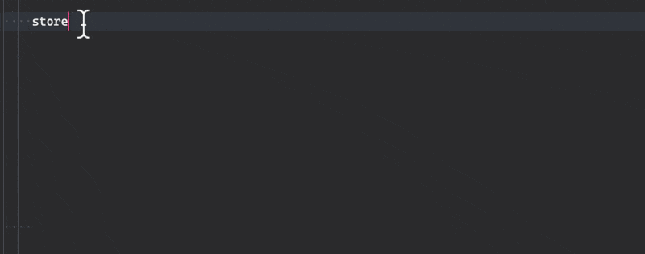
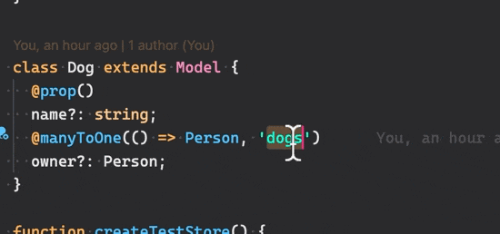

Thank you for checking!

Some 'store' highlights:

Using TypeScript 4.1 type template literals, I've created some useful type-safe utils in the store:

```ts
class Person extends Model {
  @prop()
  name?: string;
  @oneToMany(() => Dog, 'owner')
  dogs!: Collection<Dog>;
}

class Dog extends Model {
  @prop()
  name?: string;
  @manyToOne(() => Person, 'dogs')
  owner?: Person;
}

const store = createStore(
  { person: Person, dog: Dog },
  {
    // ...config
  },
);
```



---

Also, using `SubType` type helper, I've made decorators more type-safe by making sure referenced property name is targeting proper field.

In example above

```ts
  @manyToOne(() => Person, 'dogs')
  owner?: Person;
```

It would be incorrect if referenced field would be `name` instead of `dogs`:



---

### Running this demo

Run `yarn install` and then `yarn app dev`
